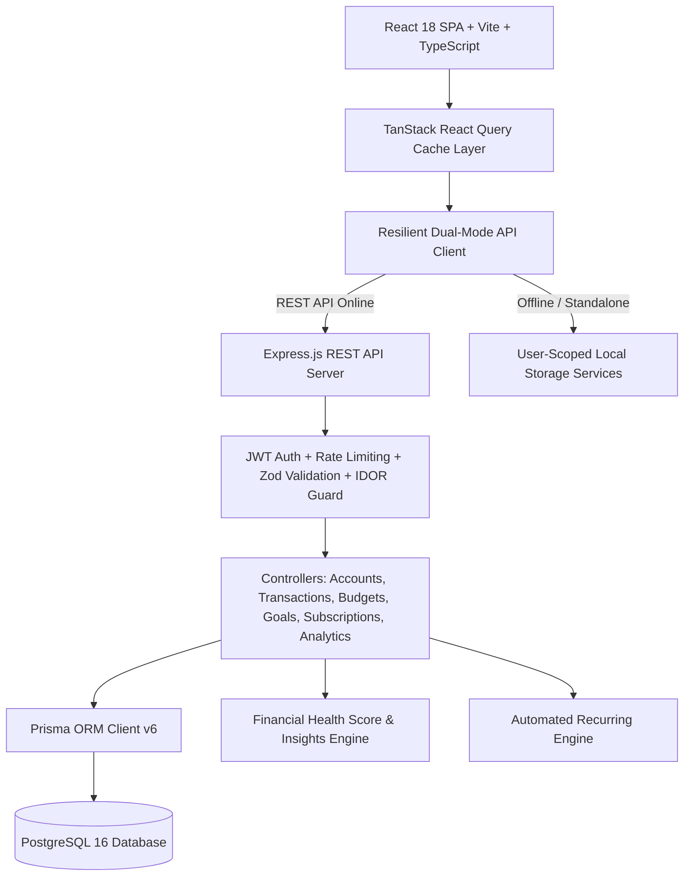

# 💎 ExpenseFlow — Personal Finance & Expense Management

<div align="center">


**A high-performance personal finance, multi-account ledger, balance sheet tracker, and AI/rule-based financial insights SaaS platform engineered with modern React architecture.**

[Key Features](#-key-features) • [React Architecture](#-react-engineering--architecture) • [Tech Stack](#-technology-stack) • [Quick Start](#-quick-start--commands) • [API & Database](#-api--database-architecture) • [Security](#-security--data-isolation)

</div>

---

## 🌟 Overview

**ExpenseFlow** is a full-stack personal finance application built with React, TypeScript, Node.js, Express, PostgreSQL, and Prisma. It provides expense tracking, multiple accounts, budgets, financial goals, recurring subscriptions, analytics, and financial insights.



---

## ⚛️ React Frontend Architecture

ExpenseFlow showcases modern React design patterns, type safety, and clean separation of concerns:

### 1. Custom React Hooks
* **`useFinancialQueries`**: Wraps `@tanstack/react-query` to provide optimistic UI updates, background revalidation, query deduplication, and automatic cache invalidation on mutations across Accounts, Subscriptions, and Analytics.
* **`useKeyboardShortcuts`**: Global listener for system-wide shortcuts (`Ctrl+K` for Command Palette, `N` for new transaction, `?` for help, direct page routing hotkeys).
* **`useTheme`**: Multi-mode theme synchronizer for Light, Dark, and OS System preference with zero layout shift.
* **`useDebounce`**: Optimizes live multi-field transaction search and filtering without UI lag.

### 2. Form State Management & Validation
* **React Hook Form + Zod**: Strict runtime schema validation, type inference, accessible error announcements, and decoupled rendering lifecycles across all modals (`TransactionFormModal`, `BudgetFormModal`, `GoalFormModal`, `AccountModal`, `SubscriptionModal`, `TransferModal`).

### 3. State Management & Offline Resilience
* **Dual-Tier Reactive State**: Combines **Zustand v5** for instant synchronous client state with **TanStack Query** for asynchronous server state synchronization.
* **Dual-Mode Client**: Operates directly with the Express REST API backend or seamlessly falls back to user-scoped offline storage with 100% feature parity.

### 4. Interactive Data Visualizations
* **Responsive Recharts**: Customized interactive Area Charts, Donut Charts, and Velocity Bar Charts with custom SVG tooltips, smooth curve transitions, and theme-adaptive palettes.

---

## ✨ Key Features

### 🏦 Multi-Account & Wallet Ledger (`/accounts`)
* **Diverse Account Types**: Checking, High-Yield Savings, Credit Cards, Cash, UPI, and Investment Portfolios.
* **Balance Sheet KPIs**: Real-time aggregation of **Liquid Assets**, **Total Debt / Liabilities**, and **Net Worth**.
* **Atomic Inter-Account Transfers**: Move funds between accounts with linked transfer IDs (`tx_transfer_out` $\leftrightarrow$ `tx_transfer_in`) and balance synchronization.

### 🧠 FinTech Health Score & Insights Engine
* **0–100 Financial Health Score**: Evaluates Savings Velocity (35 pts), Budget Discipline (25 pts), Liquidity Runway (20 pts), and Debt-to-Asset Ratio (20 pts) with dynamic grading (**A+** to **F**).
* **Weekend Velocity Spike Detection**: Automatically flags weekend spending spikes exceeding weekday baseline velocity.
* **Month-End Spend Forecasting**: Calculates daily burn rate ($\text{spent} / \text{days elapsed}$) to forecast month-end expenditure.
* **Subscription Burden Audit**: Alerts when recurring fixed commitments exceed 12% of monthly income.

### 💳 Transactions & Ledger Management (`/transactions`)
* **Full CRUD Operations**: Expense, Income, and Transfer records.
* **Multi-Criteria Filtering**: Filter by type, category, payment method, date range, and amount range.
* **Bulk CSV Import with Validation**: Drag-and-drop CSV importer with automated header mapping and duplicate detection.
* **Formula Injection Defense**: Sanitizes values starting with `=, +, -, @` to prevent spreadsheet execution vulnerabilities.
* **Interactive Undo**: 6-second actionable toast with instant transaction restoration.

### 📊 Monthly Budgets & Spending Limits (`/budgets`)
* **Category Limits**: Spending caps per category with bidirectional ID $\leftrightarrow$ Name matching.
* **Smart Upsert**: Adding a budget for an existing category updates the limit cleanly without duplicate cards.
* **Multi-Tier Alert Banners**: Flags categories near limit ($\ge 75\%$) and exceeded ($\ge 100\%$) in real time.

### 🔁 Subscriptions & Recurring Bills (`/subscriptions`)
* **Normalized Run-Rate**: Calculates unified monthly and annual commitments across weekly, monthly, quarterly, and annual billing cycles.
* **Renewal Countdown**: Live countdown displaying days remaining until the next billing date.
* **Lifecycle Controls**: Toggle subscriptions between Active, Paused, and Cancelled.

### 🎯 Financial Goals & Savings Milestones (`/goals`)
* **Milestone Tracking**: Target amounts, deadlines, categories, and custom icons.
* **Pacing Calculator**: Computes exact monthly savings required to hit targets.
* **Celebratory Confetti**: Interactive particle animations when goals reach 100% completion.

### ⚡ Global UX & Productivity
* **Command Palette (`Ctrl+K` / `Cmd+K`)**: Rapid search and navigation to any page or modal.
* **Keyboard Hotkeys (`?`)**: Full hotkey guide for power users.
* **Multi-Currency Support**: Switch between USD (`$`), EUR (`€`), GBP (`£`), INR (`₹`), and JPY (`¥`).
* **Clean Account Provisioning**: New user registrations start with a clean ledger; demo data is strictly optional.

---

## 🛠️ Technology Stack

| Layer | Technologies |
|---|---|
| **Frontend Framework** | **React 18.3.1**, TypeScript 5.7, Vite 6 |
| **State Management** | **TanStack React Query v5**, Zustand v5 |
| **Routing** | React Router DOM v6 |
| **Styling & UI** | Tailwind CSS v3.4, Lucide React Icons, PostCSS, Autoprefixer |
| **Charts & Visuals** | Recharts v2.15, Canvas Confetti |
| **Forms & Schemas** | React Hook Form v7, Zod v3.24 |
| **Date & Math** | date-fns v4, Intl.NumberFormat |
| **Backend Server** | Node.js, Express v5 (TypeScript), tsx |
| **ORM & Database** | Prisma ORM v6.19, PostgreSQL 16 |
| **Auth & Security** | JWT (jsonwebtoken), bcryptjs, Helmet, cookie-parser, express-rate-limit |
| **Testing** | Vitest v3.0 (30 passing tests) |
| **DevOps** | Docker, Docker Compose, GitHub Actions CI |

---

## 📂 Project Architecture

```text
Expense Tracker/
├── prisma/
│   └── schema.prisma              # PostgreSQL schema (User, Account, Transaction, Budget, Goal, etc.)
├── server/
│   ├── config/                    # Environment variables & server settings
│   ├── controllers/               # Route controllers (Auth, Accounts, Transactions, Budgets, Analytics)
│   ├── db/                        # Prisma client singleton
│   ├── middleware/                # JWT Auth, Zod Validation, Rate Limiter, Error Handler
│   ├── routes/                    # Express REST API routes
│   ├── services/                  # Financial Insights Engine, Recurring Engine, CSV Export Service
│   ├── app.ts                     # Express application configuration
│   └── index.ts                   # Server entry point
├── src/
│   ├── components/
│   │   ├── accounts/              # AccountModal, TransferModal
│   │   ├── analytics/             # CashFlowChart, CategoryBreakdownTable, MonthlyComparisonChart
│   │   ├── budgets/               # BudgetCard, BudgetAlertBanner, BudgetFormModal
│   │   ├── dashboard/             # NetWorthCard, FinancialHealthScoreCard, InsightsFeed, SummaryCards
│   │   ├── goals/                 # GoalCard, GoalFormModal, AddContributionModal
│   │   ├── layout/                # Sidebar, Topbar, MobileNav, CommandPalette, NotificationCenter
│   │   ├── settings/              # AppearanceSettings, CategoryManager, CurrencySettings, DataManagement
│   │   ├── subscriptions/         # SubscriptionModal
│   │   ├── transactions/          # TransactionTable, TransactionCard, FilterPanel, ImportCsvModal
│   │   └── ui/                    # Reusable primitives (Button, Modal, Input, Select, Badge, Toast, etc.)
│   ├── constants/                 # Categories, Currencies, Seed data
│   ├── hooks/                     # useFinancialQueries, useKeyboardShortcuts, useTheme, useDebounce
│   ├── pages/                     # Top-level route pages (Dashboard, Accounts, Subscriptions, Budgets, etc.)
│   ├── services/                  # apiClient (Dual-Mode), AccountService, TransactionService, etc.
│   ├── store/                     # Zustand stores (useAuthStore, useTransactionStore, useBudgetStore, etc.)
│   ├── tests/                     # Vitest automated test suites
│   ├── types/                     # TypeScript domain interfaces
│   ├── utils/                     # Pure calculations, CSV helpers, formatters
│   ├── App.tsx                    # Main App Shell & React Query Provider
│   └── main.tsx                   # React root mount
├── Dockerfile.api                 # Dockerfile for Express API
├── docker-compose.yml             # Container orchestration (PostgreSQL + API)
├── package.json                   # Scripts and dependencies
└── vite.config.ts                 # Vite bundler configuration
```

---

## 🚀 Quick Start & Commands

### Prerequisites
* **Node.js** (v18.0 or higher)
* **npm** (v9.0 or higher)
* *(Optional)* Docker & Docker Compose for local PostgreSQL

---

### 1. Installation

```bash
# Clone the repository
git clone https://github.com/VinayKrishna-7/Expense-Tracker.git
cd Expense-Tracker

# Install dependencies
npm install
```

---

### 2. Running the Frontend Application (React SPA)

```bash
# Starts the Vite React development server
npm run dev
```
Open [http://localhost:5173](http://localhost:5173) in your browser.

---

### 3. Running with Full-Stack Backend & PostgreSQL (Optional)

```bash
# 1. Start PostgreSQL with Docker Compose
docker-compose up -d postgres

# 2. Generate Prisma client & run migrations
npm run prisma:generate
npm run prisma:migrate

# 3. Start the Express REST API backend
npm run server
```

The REST API will be running on `http://localhost:5000/api`.

---

### 4. Running Automated Tests

ExpenseFlow includes a comprehensive Vitest test suite testing financial calculations, atomic transfers, CSV sanitization, and insight calculations:

```bash
npm run test
```

---

### 5. Production Build & Verification

```bash
# Compiles TypeScript and creates optimized production bundles
npm run build

# Previews the production build locally
npm run preview
```

---

## 🔒 Security & Data Isolation

* **IDOR Protection**: Every database query and API mutation enforces `{ userId: req.user.id }` checks.
* **Authentication**: Stateless JSON Web Tokens (JWT) with HTTP-only cookie support and bcrypt password hashing (10 rounds).
* **Rate Limiting**: Tiered protection against brute-force attacks on sensitive auth endpoints (`/api/auth/*`) and general API endpoints.
* **CSV Formula Injection Mitigation**: Sanitizes all export fields starting with `=, +, -, @` to protect users against malicious formula payloads when opened in Microsoft Excel or Google Sheets.
* **Zod Payload Validation**: Strict request sanitization preventing injection and parameter pollution.

---

## ⌨️ Keyboard Shortcuts Reference

| Shortcut | Action |
|---|---|
| `Ctrl + K` / `Cmd + K` | Open Command Palette |
| `N` | Open New Expense Modal |
| `/` | Focus Search Input in Transactions |
| `D` | Navigate to Dashboard |
| `T` | Navigate to Transactions |
| `B` | Navigate to Budgets |
| `A` | Navigate to Analytics |
| `G` | Navigate to Goals |
| `S` | Navigate to Settings |
| `?` | Open Keyboard Shortcuts Modal |
| `Esc` | Close Active Modal / Palette |

---

## 📄 License

This project is licensed under the **MIT License** — see the [LICENSE](LICENSE) file for details.

---

